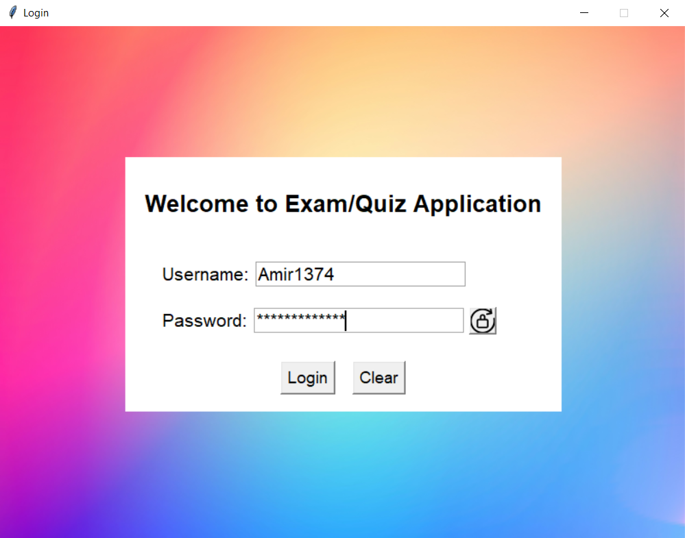
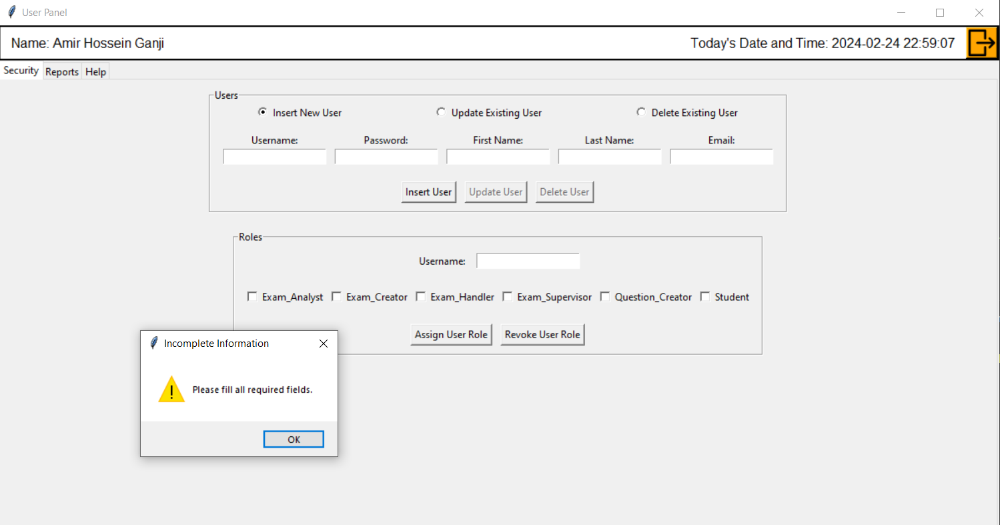
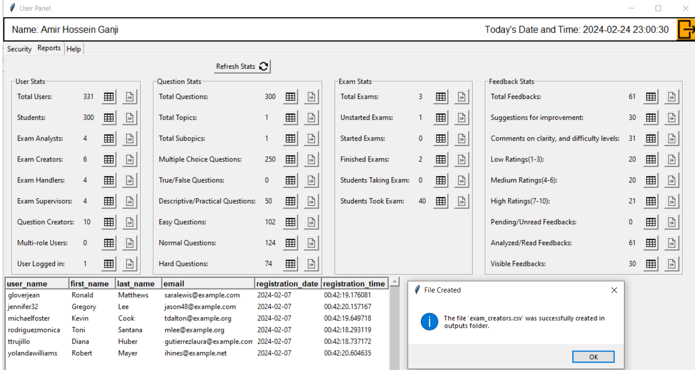
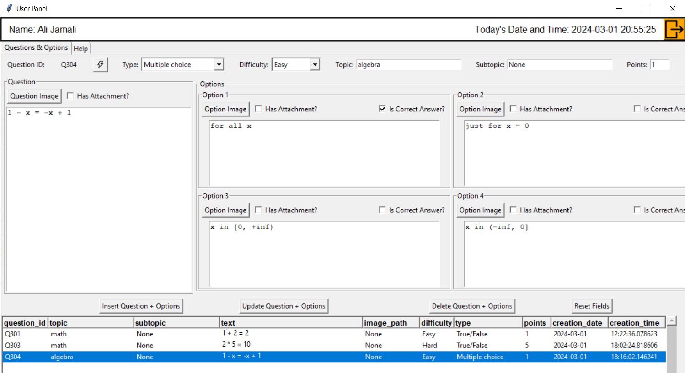
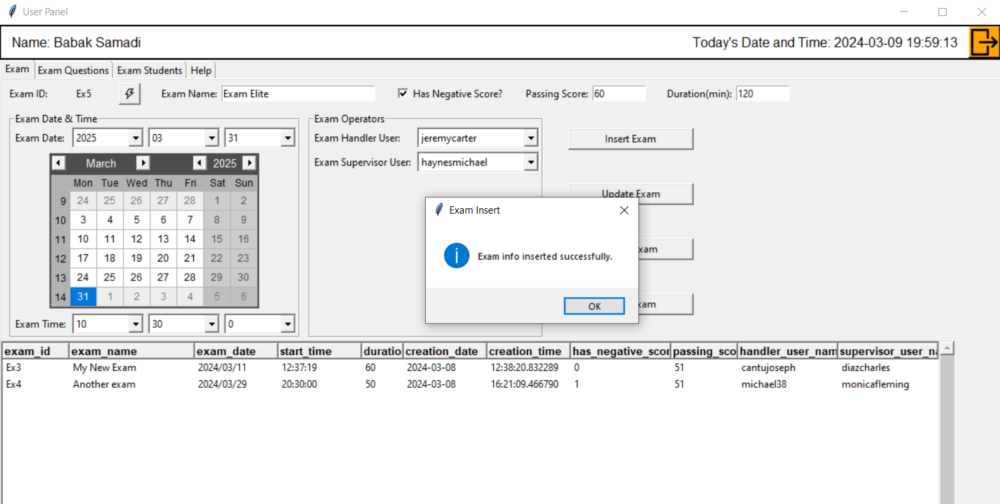
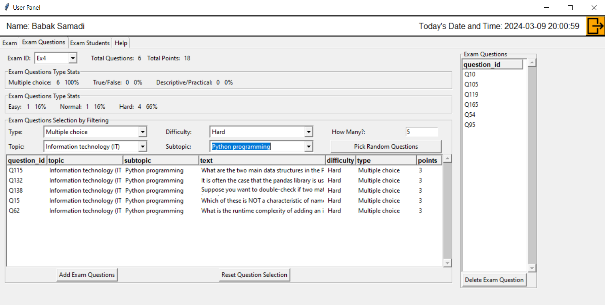
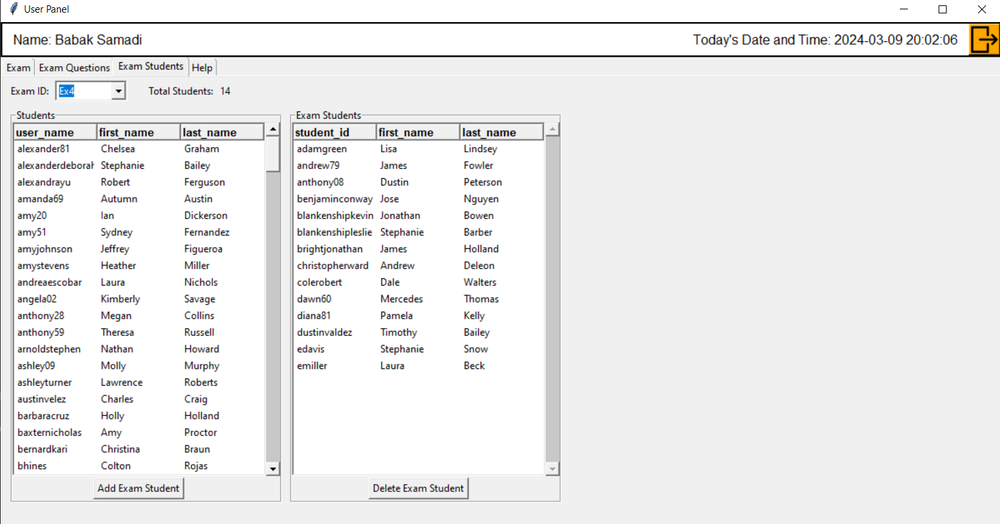

<!-- omit in toc -->
# Exam/Quiz Windows Application
[](https://www.python.org/downloads/) [](https://www.microsoft.com/en-us/windows) [](CONTRIBUTING.md)

- [Overview](#overview)
- [Features](#features)
- [Installation and Configuration](#installation-and-configuration)
  - [1. Download the Repository](#1-download-the-repository)
  - [2. Install Dependencies](#2-install-dependencies)
  - [3. Create Executable File](#3-create-executable-file)
  - [4. Deployment](#4-deployment)
- [Demo](#demo)
  - [Login Window](#login-window)
  - [Admin's Panel: Security Tab](#admins-panel-security-tab)
  - [Admin's Panel: Reports Tab](#admins-panel-reports-tab)
  - [Question-Creator's Panel: Questions \& Options Tab](#question-creators-panel-questions--options-tab)
  - [Exam-Creator's Panel: Exam Tab](#exam-creators-panel-exam-tab)
  - [Exam-Creator's Panel: Exam Questions Tab](#exam-creators-panel-exam-questions-tab)
  - [Exam-Creator's Panel: Exam Students Tab](#exam-creators-panel-exam-students-tab)
- [Running Tests](#running-tests)
- [Contributing](#contributing)
  - [Reporting Issues](#reporting-issues)
  - [Pull Requests](#pull-requests)
  - [Feature Requests](#feature-requests)
  - [Spread the Word](#spread-the-word)
  - [Code of Conduct](#code-of-conduct)
- [Roadmap](#roadmap)
  - [Short-Term Goals](#short-term-goals)
  - [Medium-Term Goals](#medium-term-goals)
  - [Long-Term Goals](#long-term-goals)
- [Documentation](#documentation)
- [Contact](#contact)
- [Support](#support)
- [Acknowledgements](#acknowledgements)

## Overview

This is a modern, feature-rich exam/quiz application designed for Windows platforms, developed entirely in Python. The application provides a user-friendly interface for creating, managing, and conducting exams or quizzes for educational or assessment purposes.

## Features

- **User Management**: Create and manage user accounts with different roles and permissions.
- **Exam Creation**: Easily create exams with customizable settings such as duration, passing score, and negative marking.
- **Question Bank**: Build a repository of questions categorized by topics, difficulty levels, and types.
- **Versatile Question Types**: Support for various question types including multiple choice, true/false, short answer, and more.
- **Image Support**: Include images in questions and answer options for enhanced interactivity.
- **Real-time Monitoring**: Supervise exam sessions in real-time and prevent cheating or unauthorized activities.
- **Result Analysis**: Analyze exam results with detailed reports and statistics.
- **Feedback Mechanism**: Utilizing feedback mechanisms, the application enables instructors to gather insights from students' responses, facilitating continuous refinement of the assessment process and improvement of user experience.
- **Security**: Implement robust security measures to protect sensitive data and ensure data integrity.
- **Customization**: Configure application settings and customize the user interface to suit specific requirements.
- **Administration Tools**: The application offers various administration tools, including:
  - **Reports**: Generate comprehensive reports on exam results, student performance, and assessment analytics for better evaluation and decision-making.
  - **User Management**: Administrators can efficiently manage user accounts, permissions, and access levels to ensure smooth operation and security.


## Installation and Configuration

### 1. Download the Repository

- Clone the repository to your local machine:

    ```bash
    git clone https://github.com/A-H-Ganji/exam-quiz-win-app.git
    ```

- Navigate to the project directory:

    ```bash
    cd exam-quiz-win-app
    ```

### 2. Install Dependencies

- Ensure you have Python installed on your machine. If not, download and install Python from [here](https://www.python.org/downloads/).

- Install dependencies using pip. Open your terminal and run:

    ```bash
    pip install -r requirements.txt
    ```

    *Note: Ensure that you have `pip` installed and added to your system's PATH.*

### 3. Create Executable File

- To create a standalone executable file (`.exe`), you can use `pyinstaller`. Run the following command:

    ```bash
    pyinstaller --onefile app.py
    ```

    This command will generate a single executable file named `app.exe` in the `dist` directory of your project.

- You may need to include additional options or configurations depending on your project's requirements. Refer to the `pyinstaller` documentation for more details.

### 4. Deployment

To deploy the Exam/Quiz Windows Application to a production environment, follow these steps:

1. Choose a server provider or hosting service that meets the application's requirements.
2. Ensure the server environment supports the necessary dependencies and configurations, including Python and any specific libraries or frameworks used by the application.
3. Clone the repository to your server using the following command:

    ```bash
    git clone https://github.com/A-H-Ganji/exam-quiz-win-app.git
    ```

4. Configure the application settings according to your production environment. This may include database configuration, environment variables, security settings, and any other relevant configurations.
5. Install the Python dependencies required by the application using pip:

    ```bash
    pip install -r requirements.txt
    ```

6. Start the application by running the appropriate command. This may vary depending on the application framework and structure.

    ```bash
    python app.py
    ```

Congratulations! Your Exam/Quiz Windows Application is now deployed and ready for use in a production environment.

---

*Note: Ensure that your Python scripts (`app.py`, `db1.py`, etc.) and any additional resources (images, databases) are included in the repository. It's recommended to organize your project structure in a clean and understandable manner.*

For any further assistance or troubleshooting, feel free to reach out to the project's maintainers or community support.
## Demo

Here are some demo GIFs and screenshots showcasing the functionality of the Exam/Quiz Windows Application:

### Login Window



### Admin's Panel: Security Tab



### Admin's Panel: Reports Tab



### Question-Creator's Panel: Questions & Options Tab



### Exam-Creator's Panel: Exam Tab



### Exam-Creator's Panel: Exam Questions Tab



### Exam-Creator's Panel: Exam Students Tab



Feel free to explore more features and functionalities of the application by downloading and running it on your local machine!

## Running Tests

The Exam/Quiz Windows Application comes with a suite of tests to ensure its functionality and integrity. To run the tests locally, follow these steps:

1. Navigate to the root directory of the project.
2. Install the necessary dependencies by running the following command:

`pip install -r requirements.txt`

3. Once the dependencies are installed, run the tests using the following command:

`python -m unittest discover -s tests -p '*_test.py'`

This command will automatically discover and execute all test files located in the `tests` directory.

If the tests pass without any failures, you can be confident in the stability and reliability of the application. In case of any failures, review the error messages and make necessary adjustments to the codebase.

Running tests regularly ensures that the application continues to meet its requirements and behaves as expected across different scenarios. Contributors are encouraged to add new tests and update existing ones as they make changes to the codebase.

## Contributing

Thank you for considering contributing to the Exam/Quiz Windows Application! Contributions from the community help improve the project and make it more valuable for everyone. Here's how you can contribute:

### Reporting Issues

If you encounter any bugs, issues, or have feature requests, please [open an issue](https://github.com/A-H-Ganji/exam-quiz-win-app/issues) on GitHub. Be sure to include detailed information about the problem and steps to reproduce it, if applicable. Your feedback helps us identify and resolve issues efficiently.

### Pull Requests

We welcome pull requests for bug fixes, enhancements, and new features. Before submitting a pull request, please ensure the following:

- Fork the repository and create your branch from `master`.
- Follow the project's coding style and guidelines.
- Write clear and concise commit messages.
- Test your changes thoroughly to ensure they function as expected.
- Update documentation or README.md if necessary.

Once your pull request is submitted, it will be reviewed by the project maintainers. We appreciate your patience during the review process and welcome any feedback or suggestions for improvement.

### Feature Requests

If you have ideas for new features or improvements, please open a discussion by [creating a new issue](https://github.com/A-H-Ganji/exam-quiz-win-app/issues) on GitHub. We value your input and will consider all suggestions to enhance the project's functionality and user experience.

### Spread the Word

Help us grow the community and reach more users by sharing the Exam/Quiz Windows Application with others. Your word-of-mouth recommendations and social media shares are greatly appreciated and help us expand our reach.

### Code of Conduct

Please note that this project adheres to the [Contributor Covenant Code of Conduct](CODE_OF_CONDUCT.md). By participating in this project, you are expected to uphold this code of conduct. Violations may result in temporary or permanent exclusion from project participation.

Thank you for your interest in contributing to the Exam/Quiz Windows Application! Together, we can make it even better for everyone.

## Roadmap

The Exam/Quiz Windows Application is continuously evolving to meet the needs of its users. Below is a glimpse of our roadmap for future development:

### Short-Term Goals

- Enhance user interface for better usability and accessibility.
- Implement support for multiple languages.
- Improve performance and optimize resource usage.
- Introduce additional question types for more diverse assessments.

### Medium-Term Goals

- Integrate advanced analytics and reporting features.
- Implement user authentication and authorization mechanisms.
- Enhance collaboration features for teachers and administrators.
- Expand platform compatibility to include macOS and Linux.

### Long-Term Goals

- Develop mobile applications for iOS and Android platforms.
- Integrate machine learning algorithms for automated question generation and assessment.
- Implement support for third-party integrations and plugins.
- Establish a comprehensive documentation and support system for users and contributors.

Our roadmap is subject to change based on user feedback, emerging technologies, and evolving industry trends. We welcome input and contributions from the community as we work towards making the Exam/Quiz Windows Application the best it can be.

Stay tuned for updates and announcements as we progress towards our goals!


## Documentation

The Exam/Quiz Windows Application comes with comprehensive documentation to help you get started with using and contributing to the project. Our documentation covers various aspects of the application, including installation instructions, usage guidelines, contribution guidelines, and more.

You can access the documentation by visiting the [Documentation](./docs) folder in the repository.

We encourage you to explore the documentation to learn more about the application's features, architecture, and best practices. If you encounter any issues or have suggestions for improving the documentation, feel free to open an issue or submit a pull request on GitHub.

Thank you for your interest in the Exam/Quiz Windows Application, and we hope you find the documentation helpful in your journey with our project!


## Contact

Feel free to reach out to me through any of the following channels:

- Email: [amirhosseinganjiii@gmail.com](mailto:amirhosseinganjiii@gmail.com)
- LinkedIn: [](https://www.linkedin.com/in/amir-hossein-ganji-aa0a72146?lipi=urn%3Ali%3Apage%3Ad_flagship3_profile_view_base_contact_details%3B5oKBboT6QIC5rCO%2BzOx%2BZw%3D%3D)
- GitHub: [](https://github.com/A-H-Ganji)
- Instagram: [](https://www.instagram.com/a.h.ganji_/)
- Telegram: [](https://t.me/AmirHo3einGanji)

Let's connect and collaborate!
## Support

If you've found the Exam/Quiz Windows Application helpful, inspiring, or valuable in any way, your support would be greatly appreciated. Here are a few ways you can contribute:

- **Spread the Word**: Share the application with your friends, colleagues, and network. Your recommendation can help reach a wider audience and benefit more users.

- **Provide Feedback**: Your feedback is invaluable in improving the application. Whether you have suggestions for new features, enhancements, or bug reports, please don't hesitate to reach out.

- **Contribute Code**: If you're technically inclined, you can contribute to the project by submitting pull requests, fixing issues, or adding new features. Contributions from the community help enhance the application and make it more robust and feature-rich.

- **Donate**: If you would like to support the continued development and maintenance of the Exam/Quiz Windows Application financially, you can consider making a donation. Even small contributions can make a big difference and are highly appreciated. You can support the project by making a donation via [Ko-fi](https://ko-fi.com/ahganji).

Your support in any form is invaluable and greatly appreciated. Thank you for being a part of this journey!


## Acknowledgements

I would like to express my gratitude to the following individuals and organizations for their contributions and support throughout the development of the Exam/Quiz Windows Application:

- **OpenAI ChatGPT**: I extend my sincere thanks to OpenAI ChatGPT for providing valuable assistance, answering numerous questions, and offering insightful information and ideas. Your guidance has been invaluable in the development process.

- **YouTube Community**: I am thankful to the YouTube community for hosting a variety of informative videos that have been instrumental in resolving challenges and expanding my knowledge. These resources have significantly enriched the development journey.

- **Google Search**: I am indebted to Google Search for serving as an indispensable tool in discovering valuable resources, solutions, and best practices. The wealth of information available through Google has been instrumental in overcoming obstacles and achieving project milestones.

- **Friends and Family**: I would like to acknowledge the unwavering support and encouragement of my friends and family throughout this endeavor. Their belief in my abilities and unwavering encouragement have been a constant source of motivation.

- **Open Source Community**: I am grateful to the vibrant open-source community for their collective contributions, which have enriched my understanding and inspired innovation in this project.

I am deeply appreciative of everyone who has contributed directly or indirectly to the success of this project.


[def]: #badges